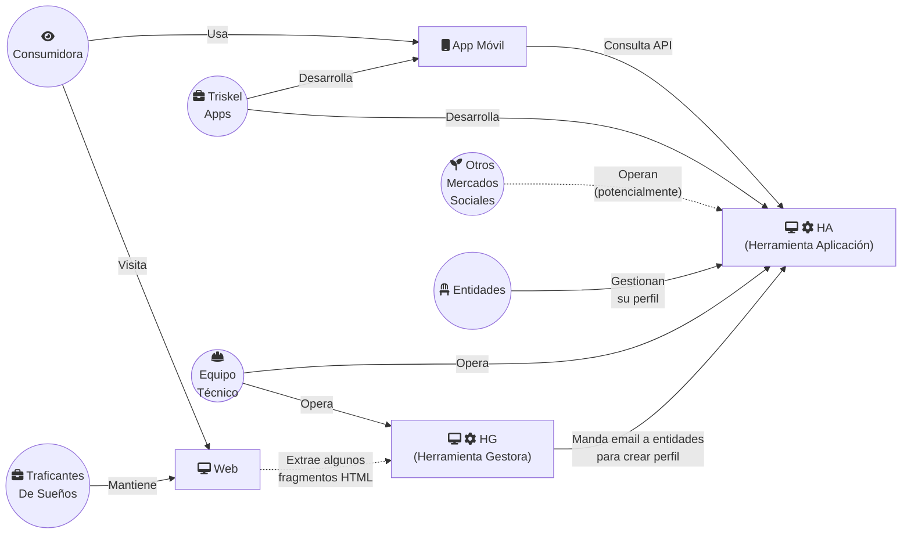

# Datos entidades Mercado Social Madrid

## Estructura

Cuatro fuentes de datos diferentes:

- El catálogo de la [Herramienta Gestora HG] (visible en la web)
- Los beneficios de [la web del MSM] (independientes de la HG)
- La API de la Herramienta Aplicación HA
- [La web del Mercado Social], que utiliza [Ensenya el Cor] (_no incluida en este análisis_)

[la web del MSM]: https://madrid.mercadosocial.net/
[Herramienta Gestora HG]: https://gestionmadrid.mercadosocial.net/
[Herramienta Aplicación HA]: https://app.mercadosocial.net

[La web del Mercado Social]: https://mercadosocial.net/territorios/madrid/
[Ensenya el Cor]: https://ensenyaelcor.org/

## Funcionamiento

- Los scripts `parse_api.py`, `parse_catalog.py`, y `parse_benefits.py`
  extraen la información de la HA, HG, y Web respectivamente
- Los scripts `clean_api.py`, `clean_catalog.py` y `clean_benefits.py`
  post-procesan los datos
- El script `check_integrity.py` comprueba el solape entre la HA y la HG
- El script `merge_data.py` combina los datos de la HA y los beneficios
  y produce `entities_full.csv` y `no_benefits.csv`

## Preguntas

- ¿Cuál es la fecha de última actualización de cada perfil social?
- ¿Qué entidades tienen LinkedIn?
- ¿Qué entidades tienen tienda online?
- ¿Qué entidades tienen un descuento activo con el MESM? ¿De qué tipo?
- ¿Qué entidades facturan periódicamente por sus servicios?
- ¿Qué entidades tienen tienda física?
- ¿Qué tipologías de ventajas hay? ¿Cuántas son relacionadas con la exención del pago del capital social?
- ¿Qué métodos hay para usar esas ventajas?
  - "Escríbenos a madrid@mercadosocial.net" / "muestra que estás registrada en la app"

## Análisis

### Catálogo

- 175 entidades (2022-11-04)
- 20 categorías
  - Categorías más pobladas: Comunicación / TICs, Desarrollo Comunitario, Educación / Empleo
  - Categorías menos pobladas: Papelería / Consumibles, Complementos / Bisutería, Crianza / Bebés
- Presencia online: Web (97 %), Facebook (77 %), Twitter (58 %), Instagram (40 %), Telegram (12 %)
  - Redes sociales por tamaño: Facebook (2910 MAU), YouTube (2562 MAU), WhatsApp (2000 MAU), Instagram (1478 MAU), Telegram (550 MAU), Twitter (436 MAU) (fuente: https://www.statista.com/statistics/272014/global-social-networks-ranked-by-number-of-users/)
  - ¿Instagram poco aprovechado?
    - Categorías más activas en Instagram: Limpieza / Jardinería / Bricolaje, Textil / Calzado, Educación / Empleo
    - Categorías menos activas en Instagram: Asesoría / Jurídicos, Desarrollo Comunitario, Turismo / Ocio / Cultura
- Beneficios / Descuentos
  - 42 entidades de 175 tienen algún tipo de beneficio (un 25 %) de las cuales
    - 9 mencionan "enseña la app en la tienda" (un 21 %),
    - 35 mencionan "escríbenos al correo para explicarte el procedimiento" (un 83 %),
    - y hay 1 que no menciona ninguna de las dos
    - nótese que hay 3 entidades que mencionan ambas
